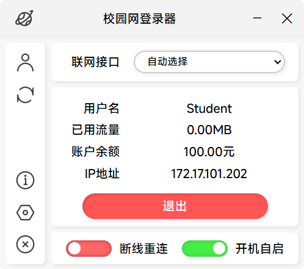

# 校园网自动登陆器（北航深澜版）
### 支持功能

1. 记住账号密码
2. 开机自动启动
3. 掉线自动重连

### 界面展示

### 使用说明
**方法一:** 前往 [Github Release](https://github.com/HofNature/SRunPy-GUI/releases) 下载EXE并直接运行  
**方法二:** Clone 本项目，使用environment.yaml创建Annaconda环境，然后运行srun_client.py  

本程序默认设置为北航网关，其它使用深澜网页认证的用户可以尝试修改srun_client.py中的srun_host后运行

### TODO
1. 编写注释
2. 支持GUI修改服务器地址
3. 支持GUI修改断线重连超时

### 致谢
本程序后端基于 [iskoldt/srunauthenticator](https://github.com/iskoldt-X/SRUN-authenticator) 修改  
前端基于 [r0x0r/pywebview](https://github.com/r0x0r/pywebview)开发