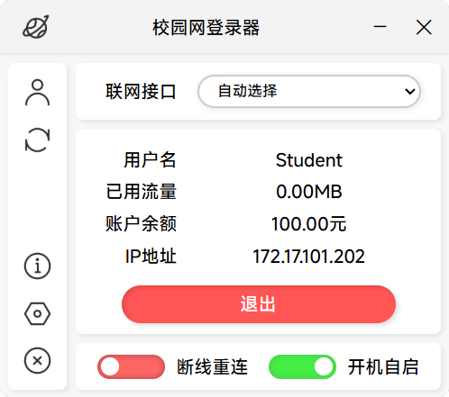

# 校园网自动登陆器（深澜网关专用）

这是适用于Windows和普通Linux的版本，本工具还提供[适用于OpenWRT的版本](https://github.com/HofNature/SRunPy-OpenWRT)。

### 支持功能

1. 记住账号密码
2. 开机自动启动
3. 掉线自动重连
4. 从命令行操作
5. 多网卡IP切换

### 界面展示



### 使用说明

**方法一:** 通过 `uv` 以工具模式安装 `srunpy`  (推荐)  

```sh
uv tool install srunpy -p 3.13
uv run srunpy
```
初次启动时会自动创建桌面快捷方式，之后可以直接双击桌面快捷方式启动程序。


**方法二:** 通过 `pip` 安装 `srunpy` 并运行 `srunpy` 

```sh
# 需要先安装Python 3.7~3.13
pip install srunpy
srunpy
```
由于深澜网关不提供登录Token，因此本程序需要保存您的账号密码才能工作。您的账户密码将会被保存在本地的配置文件中，除用于登录外不会被其他用途使用。
本程序在保存您的账号密码时会使用AES加密，但默认AES密钥可以在本开源项目中找到，为确保安全，您可以通过如下命令重新编译本程序：

```sh
pip install srunpy[build]
srunpy-build # 可通过--path指定输出路径，默认在您的桌面上
```
编译过程中会生成新的AES密钥，并硬编码到程序中，提高了您的账号密码的安全性。  此外，编译后的程序不再需要Python环境，可以直接运行。
> **注意**: 
本工具的编译借助Nuitka实现，优先使用Visual Studio 2021以上版本编译，若未安装，则会自动下载并使用MinGW64进行编译。编译后的程序无法通过pip升级，需要手动下载新版本并重新编译。  

本程序默认使用Edge WebView2作为浏览器内核，可修改为QtWebEngine, 可用  

```sh
pip install srunpy[qt]
srunpy --qt
```
**方法三:** 前往 [Github Release](https://github.com/HofNature/SRunPy-GUI/releases) 下载SRunClient.zip,解压后直接运行  
此方法无需安装Python环境，但无法使用命令行操作，且由于应用程序未签名，可能会被Windows Defender或其他杀毒软件误报。
> **注意**: 
自1.0.9版本起，不再提供编译好的可执行文件下载，如有需要可自行编译或使用pip安装。

**方法四:** 从Github Clone 本项目，然后安装  

```sh
git clone https://github.com/HofNature/SRunPy-GUI.git
cd SRunPy-GUI
pip install .
srunpy
```

**方法五:** Clone 本项目，使用 `environment.yaml` 创建 Anaconda 环境，然后运行 `srun_client.py`  

```sh
git clone https://github.com/HofNature/SRunPy-GUI.git
conda env create -f environment.yaml
conda activate srunpy
python srun_client.py
```

> **备注**:  
本程序默认设置为北航网关，其它使用深澜网页认证的用户可以点击界面左侧的设置按钮修改为自己学校的认证地址。若设备有多个网口，可在“本机IP地址”中勾选需要绑定的网卡IP并选择当前线路。  
配置文件位于C:\Users\<用户名>\AppData\Roaming\SRunPy，其中的`config.json`文件保存了用户的账号密码等信息。

### 命令行使用说明

本程序也支持命令行操作，以下是一些常用命令：

- 查看网关状态:
    ```sh
    srunpy-cli --info
    ```
- 登录网关:
    ```sh
    srunpy-cli --login --username <你的用户名> --passwd <你的密码>
    ```
- 登出网关:
    ```sh
    srunpy-cli --logout
    ```

你可以指定网关地址，例如：

```sh
srunpy-cli --login --username <你的用户名> --passwd <你的密码> --gateway <网关地址>
```

你可以使用 `--list-ips` 查看当前设备可绑定的本地IP地址：

```sh
srunpy-cli --list-ips
```

登录、登出或查询状态时，可通过重复指定 `--local-ip`（或用逗号分隔的列表）来针对多个本地IP执行操作，例如：

```sh
srunpy-cli --login --username <你的用户名> --passwd <你的密码> --local-ip 10.1.1.7 --local-ip 10.1.1.8
```

如果未指定 `--local-ip`，默认使用操作系统的自动选择策略。

### TODO

1. 编写注释
2. 支持 GUI 修改断线重连超时

### 经测试院校

1. 北京航空航天大学 沙河校区

### 致谢

本程序后端基于 [iskoldt/srunauthenticator](https://github.com/iskoldt-X/SRUN-authenticator) 修改

前端基于 [r0x0r/pywebview](https://github.com/r0x0r/pywebview) 开发

界面字体为 [MiSans Medium](https://hyperos.mi.com/font/details/sc)

---

# Campus Network Auto Login Tool (For Srun Gateway)
### Supported Features

1. Remember account and password
2. Auto start on boot
3. Auto reconnect on disconnection
4. Operate from command line
5. Multi-NIC IP switching

### Interface Display


### Usage Instructions

**Method 1:** Install `srunpy` with `uv` in tool mode (Recommended)

```sh
uv tool install srunpy -p 3.13
uv run srunpy
```
The first time you start, a desktop shortcut will be created automatically. You can then start the program by double-clicking the desktop shortcut.

**Method 2:** Install `srunpy` via `pip` and run `srunpy`

```sh
# Requires Python 3.7~3.13
pip install srunpy
srunpy
```
Since the Srun gateway does not provide a login token, this program needs to save your account and password to work. Your account and password will be saved in a local configuration file and will not be used for any other purpose.
This program uses AES encryption when saving your account and password, but the default AES key can be found in this open-source project. To ensure security, you can recompile this program with the following command:

```sh
pip install srunpy[build]
srunpy-build # You can specify the output path with --path, default is on your desktop
```
During the compilation process, a new AES key will be generated and hardcoded into the program, improving the security of your account and password. Additionally, the compiled program no longer requires a Python environment and can be run directly.
> **Note**: 
The compilation of this tool is implemented with Nuitka. It is recommended to use Visual Studio 2021 or later versions for compilation. If not installed, MinGW64 will be automatically downloaded and used for compilation. The compiled program cannot be upgraded via pip and requires manual download of the new version and recompilation.

This program uses Edge WebView2 as the browser engine by default. It can be changed to QtWebEngine, available with

```sh
pip install srunpy[qt]
srunpy --qt
```
**Method 3:** Go to [Github Release](https://github.com/HofNature/SRunPy-GUI/releases) to download SRunClient.zip, unzip and run directly  
This method does not require a Python environment but cannot use command line operations. Also, since the application is unsigned, it may be falsely flagged by Windows Defender or other antivirus software.
> **Note**:
Since version 1.0.9, precompiled executable files are no longer provided for download. If needed, you can compile it yourself or use pip to install.

**Method 4:** Clone this project from Github and then install

```sh
git clone https://github.com/HofNature/SRunPy-GUI.git
cd SRunPy-GUI
pip install .
srunpy
```

**Method 5:** Clone this project, create an Anaconda environment using `environment.yaml`, and then run `srun_client.py`

```sh
git clone https://github.com/HofNature/SRunPy-GUI.git
conda env create -f environment.yaml
conda activate srunpy
python srun_client.py
```

> **Note**:  
This program is configured for the Beihang University gateway by default. Users connecting to other Srun gateways can click the settings button on the left side of the UI to update the authentication address.
If the device has multiple network interfaces, you can check the desired network interface IPs in the "Local IP addresses" section

The configuration file is located at C:\Users\<username>\AppData\Roaming\SRunPy, where the `config.json` file saves the user's account and password information.

### Command Line Usage Instructions

This program also supports command line operations. Here are some common commands:

- Check gateway status:
    ```sh
    srunpy-cli --info
    ```
- Login to gateway:
    ```sh
    srunpy-cli --login --username <your username> --passwd <your password>
    ```
- Logout from gateway:
    ```sh
    srunpy-cli --logout
    ```

You can specify the gateway address, for example:

```sh
srunpy-cli --login --username <your username> --passwd <your password> --gateway <gateway address>
```

You can list available local IP addresses with:

```sh
srunpy-cli --list-ips
```

When running `--info`, `--login`, or `--logout`, repeat `--local-ip` (or provide a comma-separated list) to operate on multiple local interfaces, for example:

```sh
srunpy-cli --login --username <your username> --passwd <your password> --local-ip 10.1.1.7 --local-ip 10.1.1.8
```

If `--local-ip` is omitted, the default OS routing strategy is used.

### TODO

1. Write comments
2. Support GUI modification of disconnection reconnection timeout

### Tested Schools

1. Beihang University Shahe Campus

### Acknowledgements

The backend of this program is modified from [iskoldt/srunauthenticator](https://github.com/iskoldt-X/SRUN-authenticator)

The frontend is developed based on [r0x0r/pywebview](https://github.com/r0x0r/pywebview)

The interface font is [MiSans Medium](https://hyperos.mi.com/font/details/sc)