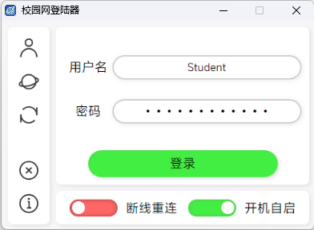

# 校园网自动登陆器（深澜网关专用）

### 支持功能

1. 记住账号密码
2. 开机自动启动
3. 掉线自动重连
4. 从命令行操作

### 界面展示



### 使用说明

**方法一:** 通过 `pip` 安装 `srunpy` 并运行 `srunpy`  (推荐)  

```sh
# 需要先安装Python 3.7~3.12
pip install srunpy
srunpy
```
初次启动时会自动创建桌面快捷方式，之后可以直接双击桌面快捷方式启动程序。

本程序默认使用Edge WebView2作为浏览器内核，可修改为QtWebEngine, 可用  

```sh
pip install srunpy[qt]
srunpy --qt
```
**方法二:** 前往 [Github Release](https://github.com/HofNature/SRunPy-GUI/releases) 下载SRunClient.zip,解压后直接运行  

**方法三:** 从Github Clone 本项目，然后安装  

```sh
git clone https://github.com/HofNature/SRunPy-GUI.git
cd SRunPy-GUI
pip install .
srunpy
```

**方法四:** Clone 本项目，使用 `environment.yaml` 创建 Anaconda 环境，然后运行 `srun_client.py`  

```sh
git clone https://github.com/HofNature/SRunPy-GUI.git
conda env create -f environment.yaml
conda activate srunpy
python srun_client.py
```

此方法无需安装Python环境，但无法使用命令行操作，且由于应用程序未签名，可能会被Windows Defender或其他杀毒软件误报。

本程序默认设置为北航网关，其它使用深澜网页认证的用户可以点击界面左侧的设置按钮修改为自己学校的认证地址。

配置文件位于C:\Users\<用户名>\AppData\Roaming\SRunPy，其中的`config.json`文件保存了用户的账号密码等信息。

### 命令行使用说明

本程序也支持命令行操作，以下是一些常用命令：

- 查看网关状态:
    ```sh
    srunpy-cli --info
    ```
- 登录网关:
    ```sh
    srunpy-cli --login --username <你的用户名> --passwd <你的密码>
    ```
- 登出网关:
    ```sh
    srunpy-cli --logout
    ```

### TODO

1. 编写注释
2. 支持 GUI 修改断线重连超时

### 经测试院校

1. 北京航空航天大学 沙河校区

### 致谢

本程序后端基于 [iskoldt/srunauthenticator](https://github.com/iskoldt-X/SRUN-authenticator) 修改

前端基于 [r0x0r/pywebview](https://github.com/r0x0r/pywebview) 开发

界面字体为 [MiSans Medium] (https://hyperos.mi.com/font/details/sc)

---

# Campus Network Auto Login Tool (For Srun Gateway)

### Supported Features

1. Remember account and password
2. Auto start on boot
3. Auto reconnect on disconnection
4. Operate from command line

### Interface Display


### Usage Instructions

**Method 1:** Install `srunpy` via `pip` and run `srunpy` (Recommended)

```sh
# Requires Python 3.7~3.12
pip install srunpy
srunpy
```
The first time you start, a desktop shortcut will be created automatically. You can then start the program by double-clicking the desktop shortcut.

This program uses Edge WebView2 as the browser engine by default. It can be changed to QtWebEngine, available with

```sh
pip install srunpy[qt]
srunpy --qt
```
**Method 2:** Go to [Github Release](https://github.com/HofNature/SRunPy-GUI/releases) to download SRunClient.zip, unzip and run directly

**Method 3:** Clone this project from Github and then install

```sh
git clone https://github.com/HofNature/SRunPy-GUI.git
cd SRunPy-GUI
pip install .
srunpy
```

**Method 4:** Clone this project, create an Anaconda environment using `environment.yaml`, and then run `srun_client.py`

```sh
git clone https://github.com/HofNature/SRunPy-GUI.git
conda env create -f environment.yaml
conda activate srunpy
python srun_client.py
```

This method does not require a Python environment, but cannot use command line operations. Also, since the application is unsigned, it may be falsely flagged by Windows Defender or other antivirus software.

This program is set to the Beihang University gateway by default. Other users using Srun web authentication can click the settings button on the left side of the interface to change to their school's authentication address.

The configuration file is located at C:\Users\<username>\AppData\Roaming\SRunPy, where the `config.json` file saves the user's account and password information.

### Command Line Usage Instructions

This program also supports command line operations. Here are some common commands:

- Check gateway status:
    ```sh
    srunpy-cli --info
    ```
- Login to gateway:
    ```sh
    srunpy-cli --login --username <your username> --passwd <your password>
    ```
- Logout from gateway:
    ```sh
    srunpy-cli --logout
    ```

### TODO

1. Write comments
2. Support GUI modification of disconnection reconnection timeout

### Tested Schools

1. Beihang University Shahe Campus

### Acknowledgements

The backend of this program is modified from [iskoldt/srunauthenticator](https://github.com/iskoldt-X/SRUN-authenticator)

The frontend is developed based on [r0x0r/pywebview](https://github.com/r0x0r/pywebview)

The interface font is [MiSans Medium] (https://hyperos.mi.com/font/details/sc)
```